<h1 align="center">Habitual Living E-Commerce Website</h1>

The sites purpose was also to demonstrate the speed and convenience of buying online, with nice back end store builder features that makes the website a viable business tool.
[View the live project here.] https://habitual-living.herokuapp.com 

## Table of Contents
* [User Experience Design (UX)](#User-Experience-Design)
    * [My Strategy](#Strategy)
        * [My Goals](#Goals)
        * [User stories](#User-Stories)
    * [My Scope](#Scope)
    * [My Structure](#Structure)
    * [My Skeleton](#Skeleton)
        * [Wireframes](#Wireframes)
        * [Database](#Database-Design)
        * [Security](#Security)
    * [My Surface](#Surface)
        * [Design](#Design)
            * [Colour Scheme](#Colour-Scheme)
            * [Typography](#Typography)
            * [Imagery](#Imagery)
* [Features](#Features)
    * [Existing Features](#Existing-Features)
* [Technologies](#Technologies)
* [Testing](#Testing)
    * [Test Results](#Test-Results)
    * [Issues and Resolutions](#Issues-and-Resolutions-to-issues-found-during-testing)
* [Deployment](#Deployment)
    * [Project Creation](#Project-Creation)
    * [GitHub Pages](#Deployment-To-Heroku)
    * [Run Locally](#Run-Locally)
    * [Fork Project](#Fork-Project)
* [Credits](#Credits)
  * [Content](#Content)
  * [Acknowledgements](#Acknowledgements)

****

## User Experience Design
### **Strategy**

My focus here is to lure buyers into purchasing a particular variety of product types for the home environment.
The site is the foundation of a whole bigger enterprise as far as eccomerce sites go, but it's a solid platform to build out from.

#### **Goals**
* To eventually fashion buyers into buying products not always readily available in general stores. 
* Using the website would be a convenient way for customers to buy innovative product designs. They can expect regular updates to the product database.

#### User stories

* First Time Visitor Goals - Standard, 'Just looking'

*   1. Standard Access window shopper ||  I want to easily view what I am buying so that I can make a purchase based on a product that I might not have known before visiting the site.
*   2. Standard Access window shopper ||  I want to easily visualise a products description so I can get a good understanding of what to expect from my purchase.  
*   3. Standard Access window shopper ||  I want to be able to differentiate between exotic items, and then decide on wether it's worth buying for the price.
*   4. Standard Access window shopper ||  If I was to buy the product then the site would have to provide some some way of generating a visual aide to help guide my spending.
        
* A subscribed users Goals - Exclusive 'Ok I have signed up...now what'?

*   1. Exclusive Access subscribers   ||  Well, I want to have exclusive membership to take advantage of any offers available.
*   2. Exclusive Access subscribers   ||  Could I store my purchases in a shopping bag and get back to it later?. Would I need my own user profile? Could I recover my account? 
*   3. Exclusive Access subscribers   ||  Would I be notified as to wether I have joined as a subscriber because I really like the itinery of products and want to buy.

* Frequent User Goals - 'Not a bad place to shop to be fair'...

*   1. As a returning shopper ||  How easy is it for me to find the items I need? - Is there a system to make the process of finding the product straightforward, by category or price for example?.
*   2. As a returning shopper ||  I understand the product genre, if only there was a way to search what I need across a broader range of categories.
*   3. As a returning shopper ||  If the product wasn't available would there be a way to leave feedback?

### **Scope**

So the user triggers many possible scenarios. To address those concerns the following scope of ideals might help answer those concerns.

**Regular Tech Gadgets uploaded:**
* Creates, Reads, Updates Deletes 
* Log in/out protocols.
* Stored items are accessable by using unique profiles.
* Site works well on all screen sizes, users enjoy relevant UX detail.
* Backend Django admin covers easy product updates and sets administrative priviledges on the database.
* Defensive Design to keep the user honest.

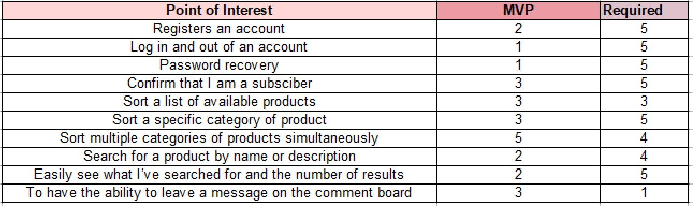
With alot of ground to cover breaking down what's a must have verses a minimum viable product especially where the site functionality is concerned, becomes a huge undertaking.
However the site is geared to keep the user informed every step of the way.

### **Structure**

User Story:
> Site users are under no illusion that they are joining on to an eccomerce website offering.

Branding:
* The brand of the website is in the name Habitual Living which is the site logo. Infact the logo is visable throughout to give off a strong engaging prescence.
* The Logo will always navigate back to the Home Page and displays the sites purpose which is 'Ideas For Your Perfect Home'.
* It has a pleasant, clean look and feel and has a modern welcoming introduction with an eye catching red :orange: hover over :Red: button to entice the user into the site. 

Viewpoint:
* The site is easy to use and designed for maximum efficiency with convenient buttons and nav links making for a smooth experience.

Mandatories:
* Navigational items, such as buttons and links are consistent and menus are available at all times.

Actuals:

* Again, nav bars are always available, and once used will direct the site user to their pages of choice. They might be intrigued at first by the navlink names used to evoke a sense of class.
* The user has an immediate option to access a shopping bag regardless of whether they were subscribed or not. 
* Shopping bag verses an unsubsribed user might be a handy way of luring the customer into eventually buying something from the store.
* Beside the shopping trolley icon the user can choose to log, join by registering a subscription or simply leave a comment *not developed at the time of writing this*
* There is a handy search bar above a marketing banner tht is easily accessable for helping the user to decide what to buy!
* If you were switching to view the site on a mobile, then you would be able to use a nice collapsable nav bar which is made accessable via the hamburger styles icon on the top left hand side of your device. 
* There you have different visual approach wherein the nav items are cascaded downwards on the LHS of the screen. 
* Again the shopping bag and links to the product pages remain intact.

As far as navigation goes it flows like.....

* 'Habitual-Living'- (BrandLogoHome) 
* 'All products'   - (BreaksToFourAreas)    - 'Price'           - 'Rating'              - 'Category',         - 'All_Products',
* 'Luxury'         - (BreaksToFourAreas)    - 'Gourmet_Spa'     - 'Living_Space',       - 'Outdoor',          -'All_Luxury',
* 'Essentials'     - (BreaksToThreeAreas)   - 'Lighting_Sound', - 'Security_Data',      - 'All_Essentials',
* 'Exclusives'     - (BreaksToFourAreas)    - 'Discovery',      - 'Offers', 'Deals',    - 'All Exclusives',
* 'SearchField'    - (AddToBag)             -  (Toast),         - 'Secure_Checkout',    - 'Checkout',         -  'Complete_Order',   -  (Toast) 'Success', 
* 'My Account'     - (Subscribe)            -  'Sign Up',       - (Toast),              - 'Verify_Email'
* 'Sign In'        - (UserNameOrEmail)      -  'Home',
* 'Shopping Bag'   - (FullAccess)
* 'Products'       - (AddToBag)             -  (Toast),         - 'Secure_Checkout',    - 'Checkout',          - 'Complete_Order',   -  (Toast) 'Success', 
* 'Latest Deals'   - (Home)

Visuals

* Works accoss all screen sizes with zero horizontal push/pull back.
* Media images are rendered well within the contstraints of their max width.
* Dynamic [Bootstrap4] popout cards contain images of products, quantity & descriptions.
* Visually appealing 'mobile first' rsponsive design.
* Neutral color schemes for eye comfort, prolonging screen time.

Operations

* Add profile pages, when logging in to your account (after verification, fictional based development).
* Users can add product, update quantities, delete quantities.
* Superusers can maintain the site administration by adding, removing and updating product prices via both front and back end interfaces.
* When the user signs up they can verify their credentials by recieving email in to their personal account thanks to 'STRIPE' webhooks.(fictional based development).
* A users purchase information can also be sent to the users inbox in like manner (fictional based development).
* Viable toast notifications are made avaiable as a visual communicator, they will allow users to become inform along their journey throughout the site.
* Defensive measure are in place to prevent user accessing superuser administrative priviledges.

### **Skeleton**
#### Wireframes
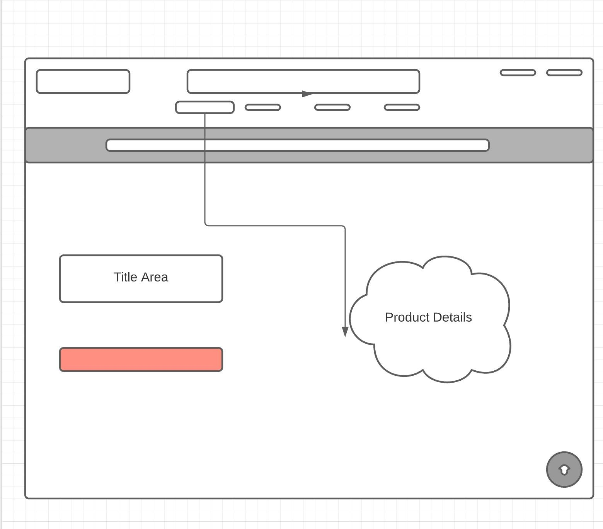
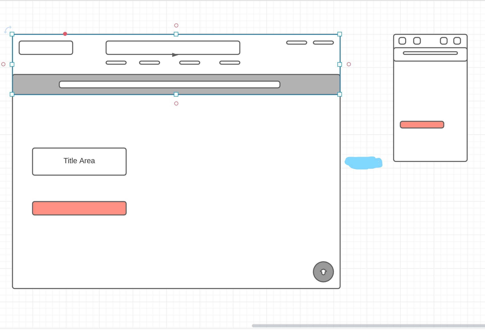
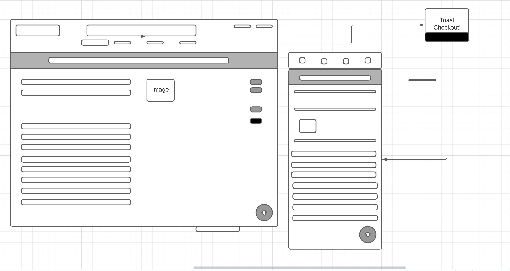
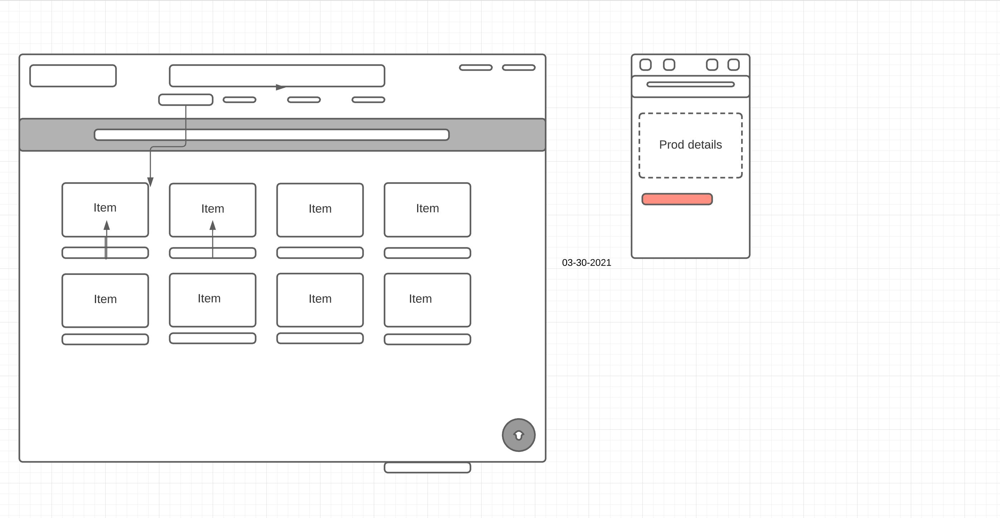

#### Database Design **Django admin visuals**

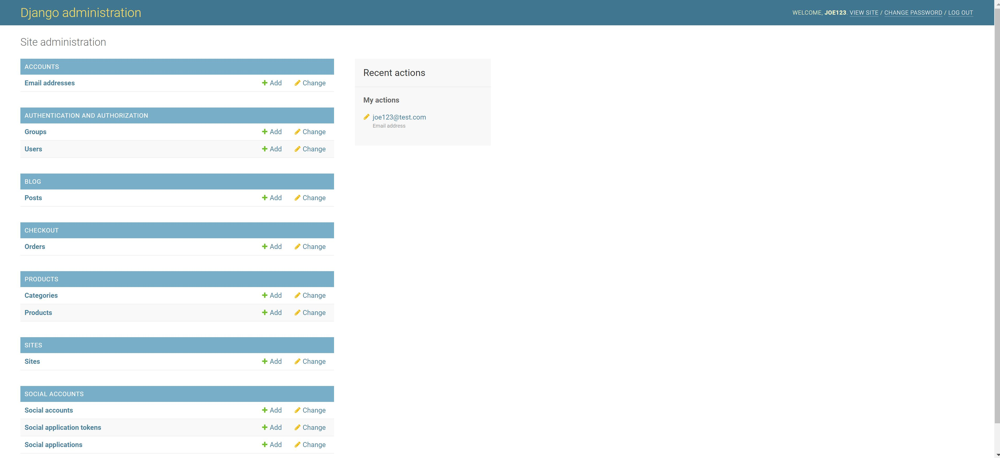
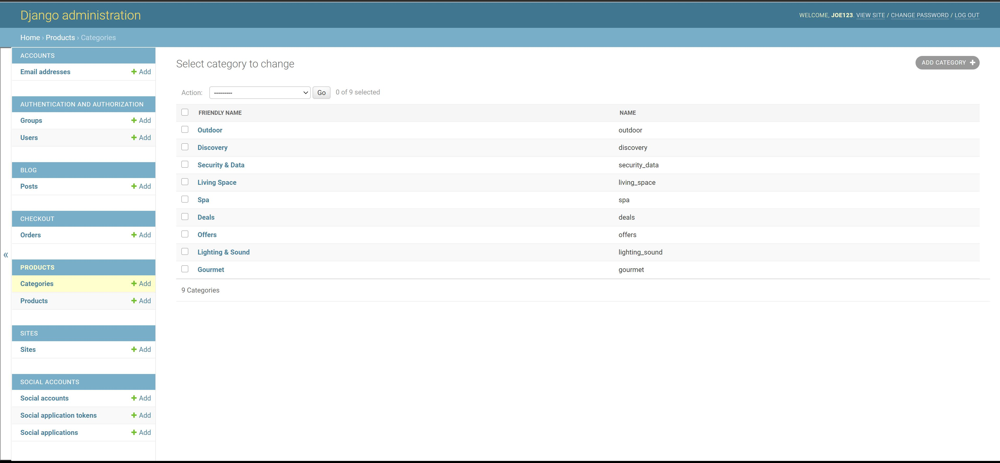

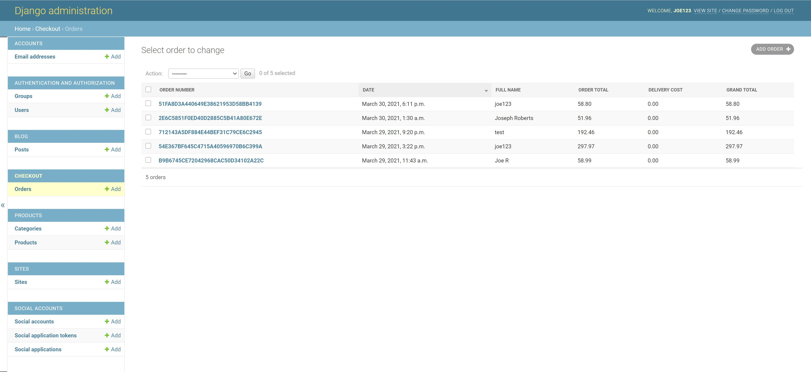
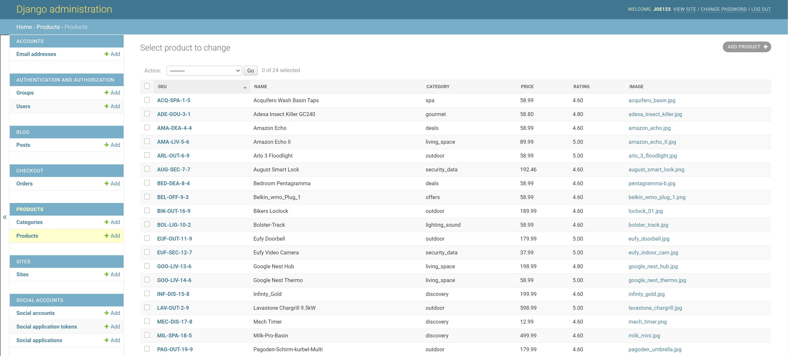
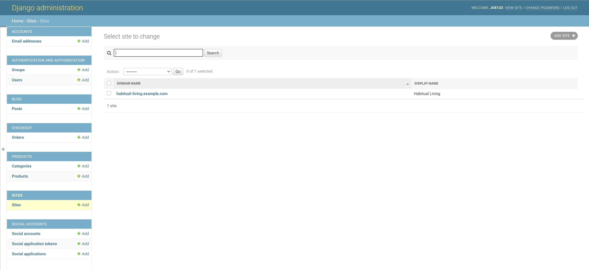
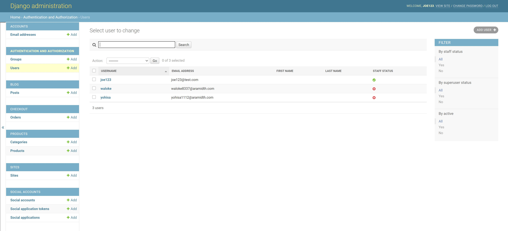

* I designed this JSON coded database design & references:

[
  {
    "pk": 1,
    "model": "products.category",
    "fields": {
      "name": "gourmet",
      "friendly_name": "Gourmet"
    }
  },
  {
    "pk": 2,
    "model": "products.category",
    "fields": {
      "name": "lighting_sound",
      "friendly_name": "Lighting & Sound"
    }
  },
  {
    "pk": 3,
    "model": "products.category",
    "fields": {
      "name": "offers",
      "friendly_name": "Offers"
    }
  },
  {
    "pk": 4,
    "model": "products.category",
    "fields": {
      "name": "deals",
      "friendly_name": "Deals"
    }
  },
  {
    "pk": 5,
    "model": "products.category",
    "fields": {
      "name": "spa",
      "friendly_name": "Spa"
    }
  },
  {
    "pk": 6,
    "model": "products.category",
    "fields": {
      "name": "living_space",
      "friendly_name": "Living Space"
    }
  },
  {
    "pk": 7,
    "model": "products.category",
    "fields": {
      "name": "security_data",
      "friendly_name": "Security & Data"
    }
  },
  {
    "pk": 8,
    "model": "products.category",
    "fields": {
      "name": "discovery",
      "friendly_name": "Discovery"
    }
  },
  {
    "pk": 9,
    "model": "products.category",
    "fields": {
      "name": "outdoor",
      "friendly_name": "Outdoor"
    }
  }
]

[
  {
    "pk": 1,
    "model": "products.product",
    "fields": {
      "sku": "ACQ-SPA-1-5",
      "name": "Acquifero Wash Basin Taps",
      "description": "Acquifero is a collection with a particularly essential design and are made in AISI 316L stainless.",
      "price": 58.99,
      "category": 5,
      "rating": 4.6,
      "image_url": "https://cdn.bigbathroomshop.co.uk/media/catalog/product/cache/07469e52453ec3e9e92a88c7a63b12d8/b/t/bt0117c_hr_a_gimp_zoomed.jpg",
      "image": "acquifero_basin.jpg"
    }
  },
  {
    "pk": 2,
    "model": "products.product",
    "fields": {
      "sku": "LAV-OUT-2-9",
      "name": "Lavastone Chargrill 9.5kW",
      "description": "This premium counter top commercial lava rock chargrill is fitted with heavy duty straight burners.",
      "price": 598.99,
      "category": 9,
      "rating": 5,
      "image_url": "https://adexa.co.uk/image/cache/catalog/Adexa/6LG020-1200x1200.jpg",
      "image": "lavastone_chargrill.jpg"
    }
  },
  {
    "pk": 3,
    "model": "products.product",
    "fields": {
      "sku": "ADE-GOU-3-1",
      "name": "Adexa Insect Killer GC240",
      "description": "This commercial fly killer is perfect for keeping areas free from unwanted pests such as flies.",
      "price": 58.8,
      "category": 1,
      "rating": 4.8,
      "image_url": "https://adexa.co.uk/image/cache/catalog/Adexa/GC240-1200x1200.jpg",
      "image": "adexa_insect_killer.jpg"
    }
  },
  {
    "pk": 4,
    "model": "products.product",
    "fields": {
      "sku": "AMA-DEA-4-4",
      "name": "Amazon Echo",
      "description": "The 3th gen Amazon Echo premium sound and added features.",
      "price": 58.99,
      "category": 4,
      "rating": 4.6,
      "image_url": "https://images-na.ssl-images-amazon.com/images/I/71Q9d6N7xkL._AC_SL1000_.jpg",
      "image": "amazon_echo.jpg"
    }
  },
  {
    "pk": 5,
    "model": "products.product",
    "fields": {
      "sku": "AMA-LIV-5-6",
      "name": "Amazon Echo II",
      "description": "The 4th gen Amazon Echo brings an updated look, premium sound and added features.",
      "price": 89.99,
      "category": 6,
      "rating": 5,
      "image_url": "https://images-na.ssl-images-amazon.com/images/I/71Q9d6N7xkL._AC_SL1000_.jpg",
      "image": "amazon_echo_II.jpg"
    }
  },
  {
    "pk": 6,
    "model": "products.product",
    "fields": {
      "sku": "ARL-OUT-6-9",
      "name": "Arlo 3 Floodlight",
      "description": "Works with Alexa for voice control (Alexa device sold separately). Wireless Requirements-2.4GHertz Wi-Fi network.",
      "price": 58.99,
      "category": 9,
      "rating": 5,
      "image_url": "https://brain-images-ssl.cdn.dixons.com/0/0/10214100/u_10214100.jpg",
      "image": "arlo_3_floodlight.jpg"
    }
  },
  {
    "pk": 7,
    "model": "products.product",
    "fields": {
      "sku": "AUG-SEC-7-7",
      "name": "August Smart Lock",
      "description": "Works with Alexa for voice control (Alexa device sold separately). Wireless Requirements-2.4GHertz Wi-Fi network (Connect Wi-Fi Bridge sold separately). Control and monitor your door from anywhere. Lock and unlock your door, control keyless access and keep track of who comes and goes, all from your phone.",
      "price": 192.46,
      "category": 7,
      "rating": 4.6,
      "image_url": "https://images-na.ssl-images-amazon.com/images/I/51Lm7sw46GL._AC_SL1000_.jpg",
      "image": "august_smart_lock.png"
    }
  },
  {
    "pk": 8,
    "model": "products.product",
    "fields": {
      "sku": "BED-DEA-8-4",
      "name": "Bedroom Pentagramma",
      "description": "Modular bed head in solid canaletta walnut. The bed head can be made up of one individual lateral unit of cm.105 for a single bed, or of two lateral units with a total width of cm.210.",
      "price": 58.99,
      "category": 4,
      "rating": 4.6,
      "image_url": "https://image.architonic.com/img_pro2-4/114/9263/pentagramma-b.jpg",
      "image": "pentagramma-b.jpg"
    }
  },
  {
    "pk": 9,
    "model": "products.product",
    "fields": {
      "sku": "BEL-OFF-9-3",
      "name": "Belkin_wmo_Plug_1",
      "description": "The Wemo Switch gives you control of your lamps and small appliances whenever you want, wherever you choose, with tonnes of options for scheduling and automation. Paired with Amazon Alexa or Google Assistant.",
      "price": 58.99,
      "category": 3,
      "rating": 4.6,
      "image_url": "https://www.digitalsave.co.uk/images/detailed/6/belkin_wmo_plug_1.png",
      "image": "belkin_wmo_plug_1.png"
    }
  },
  {
    "pk": 10,
    "model": "products.product",
    "fields": {
      "sku": "BOL-LIG-10-2",
      "name": "Bolster-Track",
      "description": "Choose the fully chromed versions with mirror effect or tone things down with the matte black or white versions, which also have a chromed edge. Available as a foot, recessed, track and pendant variant.",
      "price": 58.99,
      "category": 2,
      "rating": 4.6,
      "image_url": "https://image.architonic.com/img_pro2-4/102/0867/bolster-foot-ar111-11050309-surface-b.jpg",
      "image": "bolster_track.jpg"
    }
  },
  {
    "pk": 11,
    "model": "products.product",
    "fields": {
      "sku": "EUF-OUT-11-9",
      "name": "Eufy Doorbell",
      "description": "Wireless Video Doorbell (Battery-Powered) with 2K HD, No Monthly Fee, On-Device AI for Human Detection, 2-Way Audio, Simple Self-Installation",
      "price": 179.99,
      "category": 9,
      "rating": 5,
      "image_url": "https://cdn.shopify.com/s/files/1/0504/1094/6753/products/E8210_Battery_Video_Doorbell_2K_EF_BC_88_E9_BB_91_EF_BC_89_2048x.jpg?v=1608126414",
      "image": "eufy_doorbell.jpg"
    }
  },
  {
    "pk": 12,
    "model": "products.product",
    "fields": {
      "sku": "EUF-SEC-12-7",
      "name": "Eufy Video Camera",
      "description": "t includes the Thermostat E and the Heat Link E. The Heat Link goes in the same place as your current thermostat, while the Thermostat E can be placed somewhere handy in your home.",
      "price": 37.99,
      "category": 7,
      "rating": 5,
      "image_url": "https://cdn.shopify.com/s/files/1/0504/1094/6753/products/T8400--800x800_2048x.jpg?v=1608126492",
      "image": "eufy_indoor_cam.jpg"
    }
  },
  {
    "pk": 13,
    "model": "products.product",
    "fields": {
      "sku": "GOO-LIV-13-6",
      "name": "Google Nest  Hub",
      "description": "t includes the Thermostat E and the Heat Link E. The Heat Link goes in the same place as your current thermostat, while the Thermostat E can be placed somewhere handy in your home.",
      "price": 198.99,
      "category": 6,
      "rating": 4.8,
      "image_url": "https://storage.googleapis.com/mannequin/blobs/ad8f6ace-de2c-4627-b38e-e34f6e3469d0.mp4",
      "image": "google_nest_hub.jpg"
    }
  },
  {
    "pk": 14,
    "model": "products.product",
    "fields": {
      "sku": "GOO-LIV-14-6",
      "name": "Google Nest Thermo",
      "description": "Supplied in this pack of two and with its classic eye catching design the Google Nest Learning Thermostat is not only beautiful to look at but learns the temperature that you like, then programs itself.",
      "price": 58.99,
      "category": 6,
      "rating": 5,
      "image_url": "https://encrypted-tbn0.gstatic.com/shopping?q=tbn:ANd9GcS67blxViRUikoDzbicmo8ZM6XT4fjin0TX_4AsYsQ2KQNc0YF2IQ&usqp=CAc",
      "image": "google_nest_thermo.jpg"
    }
  },
  {
    "pk": 15,
    "model": "products.product",
    "fields": {
      "sku": "INF-DIS-15-8",
      "name": "Infinty_Gold",
      "description": "Ninja Titanium Gold Mirror \"ALLOY's innovative Titanium-plated Gold Mirror Finish has been designed to capture the striking gold colour of brass in a mirror",
      "price": 199.99,
      "category": 8,
      "rating": 4.6,
      "image_url": "https://image.architonic.com/img_pro2-4/109/9397/infinity_Amber_bru_1_01_br.jpg",
      "image": "infinty_gold.jpg"
    }
  },
  {
    "pk": 16,
    "model": "products.product",
    "fields": {
      "sku": "BIK-OUT-16-9",
      "name": "Bikers Loclock",
      "description": "Bicycle rack in recycled polyethylene with UHPC inside reinforcement. Dimensions: 83 x 12 x 85 cm Weight: 20 kg Installation: Base embedding in the pavement",
      "price": 189.99,
      "category": 9,
      "rating": 4.6,
      "image_url": "https://image.architonic.com/pro2-3/20157142/loclock-01-pro-b-arcit18.jpg",
      "image": "loclock_01.jpg"
    }
  },
  {
    "pk": 17,
    "model": "products.product",
    "fields": {
      "sku": "MIL-SPA-18-5",
      "name": "Milk-Pro-Basin",
      "description": "0 tap hole suspended washbasin with overflow hole cm. 40x28xh.15,5 (1 tap hole left or right only on request)",
      "price": 499.99,
      "category": 8,
      "rating": 4.6,
      "image_url": "https://image.architonic.com/pro2-3/20157923/milk-f-001526-pro-b-arcit18.jpg",
      "image": "milk_mini.jpg"
    }
  },
  {
    "pk": 18,
    "model": "products.product",
    "fields": {
      "sku": "MEC-DIS-17-8",
      "name": "Mech Timer",
      "description": "Salter Mechanical Timer - Stainless Steel. Stainless steel mechanical timer. 60 minute count down time. Soft touch rubber turn knob. Easy to read dial. Extra long alarm. 1 year guarantee. Stainless steel/Black",
      "price": 12.99,
      "category": 8,
      "rating": 4.6,
      "image_url": "https://cdn.shopify.com/s/files/1/0248/3915/9844/products/41kj_7E08vL_1024x1024.jpg?v=1612438391",
      "image": "mech_timer.png"
    }
  },
  {
    "pk": 19,
    "model": "products.product",
    "fields": {
      "sku": "PAG-OUT-19-9",
      "name": "Pagoden-Schirm-kurbel-Multi",
      "description": "240 cm Powder-coated aluminum frame; fiberglass rods; covering ACRYLFABRIC Accessories: Crank with Tilt mechanism",
      "price": 179.99,
      "category": 9,
      "rating": 4.6,
      "image_url": "https://image.architonic.com/img_pro2-4/146/4108/pagoden-schirm-kurbel-multi2-b.jpg",
      "image": "pagoden_umbrella.jpg"
    }
  },
  {
    "pk": 20,
    "model": "products.product",
    "fields": {
      "sku": "PHI-LIG-20-2",
      "name": "Phillips Hue",
      "description": "Control your lighting from your smartphone Includes bridge / bulbs x 2 Works with Apple HomeKit / Google Assistant / Amazon Alexa Choose from 16 million colours Sync lights with movies and music",
      "price": 98.49,
      "category": 2,
      "rating": 4.6,
      "image_url": "https://brain-images-ssl.cdn.dixons.com/8/3/10186638/u_10186638.jpg",
      "image": "phillips_hue.jpg"
    }
  },
  {
    "pk": 21,
    "model": "products.product",
    "fields": {
      "sku": "SAL-DIS-21-8",
      "name": "Salter-Contour-Digital-Timer",
      "description": "Take the guesswork out of cooking and baking with this handy kitchen digital timer from Salter. You can set it to count up or count down, with a 99 minutes, 59 seconds maximum time.",
      "price": 13.99,
      "category": 8,
      "rating": 4.6,
      "image_url": "https://www.robertdyas.co.uk/media/catalog/product/cache/ee7f57371963fdaf9f4353c1acf7bd18/u/n/untitled-1_0005_103790.jpg",
      "image": "salter_digital_timer.png"
    }
  },
  {
    "pk": 22,
    "model": "products.product",
    "fields": {
      "sku": "STO-SPA-22-5",
      "name": "Porro storage-dressing",
      "description": "Offering three different types of wardrobe structures, Storage is the first sectional system that creates continuity of space in the whole wardrobe. The innovation arises from the new concept of the bearing structure: the side.",
      "price": 250.00,
      "category": 5,
      "rating": 4.6,
      "image_url": "https://image.architonic.com/img_pro2-1/140/1008/storage-dressing-001-y-b.jpg",
      "image": "storage_dressing.jpg"
    }
  },
  {
    "pk": 23,
    "model": "products.product",
    "fields": {
      "sku": "SUP-SPA-23-9",
      "name": "superlock-01-pro-b-arcit18",
      "description": "Bicycle rack in recycled polyethylene with UHPC concrete inside reinforcement. Dimensions: 83 x 12 x 85 cm Weight: 20 kg Installation: Base embedding in the pavement.",
      "price": 229.99,
      "category": 9,
      "rating": 4.6,
      "image_url": "https://image.architonic.com/pro2-3/20157151/superlock-01-pro-b-arcit18.jpg",
      "image": "superlock_01.jpg"
    }
  },
  {
    "pk": 24,
    "model": "products.product",
    "fields": {
      "sku": "ZIG-LIG-24-2",
      "name": "zig-zag-piantana-neu-b",
      "description": "Satin Nickel Metal Wall Sconces and floor lamps.",
      "price": 299.99,
      "category": 2,
      "rating": 5,
      "image_url": "https://image.architonic.com/img_pro2-4/107/6261/zig-zag-piantana-neu-b.jpg",
      "image": "zig_zag_piantana.jpg"
    }
  }
]

#### Security

Database connection details are set up in environ.os settings for development, [True] 
and won't go through version control, the stored SECRET_KEYS in Gitpods workspace 'env' correspond to those that are stored in the Heroku config variables and Stripe.
I also set up a email host, 2 step authentication to link my local Google account to Django using the Heroku configuration variables.

### **Surface**
### Design
#### Colour Scheme
* Mainly Light gray, dark gray, black, orange, red, white yellow
* I have used the color properties 
* [#73767a]; [#f54b48]; [#283342]; [#aab7c4]; [#3f4952]; [#f8f8f8]; [#7397a7]; [#000]; [#fff[]; [Black]; [White]; across the site with
* [#6c757d]; [#28a745]; [#ffc107]; [#17a2b8]; [#f8f9fa]; [#343a40]; as convenience colours from ['boostrap4']
* Some of the Psychological properties of colours text in the project was found [here](http://www.colour-affects.co.uk/psychological-properties-of-colours) 
* [#F7EC36]; [#F7EC36]; [#FAAC42]; [#ec110d]; [#dc3545]. 

#### Typography
* Nunito is used as the only font as it is 'a well balanced sans serif typeface'. provided by [GoogleFonts] - https://fonts.google.com/specimen/Nunito?preview.text_type=custom#glyphs
*  This font is the only style used throughout the whole website with a default Sans Serif as the fallback font in case for any reason the font isn't being imported into the site correctly. 

#### Imagery
* The Landing page hosts a background image by 'Samantha Gades' '/media/samantha-gades-BlIhVfXbi9s-unsplash.jpg' taken from'['unsplash'] - I took inspiration from the clean subtle look 
  and the ideal Home life for some suited the overall look and feel of the website.

****
## Features

### Existing Features

* User notifications.
* Sign in / Sign out back end verification.
* Product set easy accessable
* Create feedback allowing all users to leave comments (under development).
* Profile page showing basic user information and events created by the user with modification ability.
* Mobile responsive design.

### Features Left to Implement

A feature to be included in the next release will allow users the ability to leave feedback on their experience using the site and discuss various topics around purchases.

****
## Technologies used
* [HTML](https://en.wikipedia.org/wiki/HTML)
	* This project uses HTML as the main language used to complete the structure of the Website.
* [CSS](https://en.wikipedia.org/wiki/CSS)
	* This project uses custom written CSS to style the Website.
* [JavaScript](https://en.wikipedia.org/wiki/JavaScript)
    * JavaScript is used along with [stripe](https://www.stripe.com/) for the email real time notification webhooks.
* [Jinja2](https://jinja.palletsprojects.com/en/2.11.x/)
    * 'Jinja is a modern and designer-friendly templating language for Python, modelled after Django’s templates'. 
* [jQuery](https://jquery.com/) is used for the following: 
    * Scrollup Materialize elements. 
* [Python](https://www.python.org/)
    * This projects core was created using Python, the back-end logic and the means to run/view the Website.
    * Python Modules used (These can be found in the requirements.txt project file):
* [[Stripe](https://www.stripe.com/) ] 'It is fast, widely used and secure with the optional sandboxed template execution environment'.
    * Used to trigger Django views letting you know that an events has occurred, allowing the webhook view handler
    to handle the event in a variety of differing ways. This effectively allows us to listen to messages from Stripe. 

****
        Package             Version
        ------------------- -------
    *    asgiref             3.3.1
    *    boto3               1.17.40
    *    botocore            1.20.40
    *    dj-database-url     0.5.0
    *    Django              3.1.7   
    *    django-allauth      0.44.0
    *    django-countries    7.1
    *    django-crispy-forms 1.11.2
    *    django-storages     1.11.1
    *    gunicorn            20.1.0
    *    jmespath            0.10.0
    *    oauthlib            3.1.0
    *    Pillow              8.1.2
    *    postgres            3.0.0
    *    psycopg2-binary     2.8.6
    *    psycopg2-pool       1.1
    *    PyJWT               2.0.1
    *    python3-openid      3.2.0
    *    pytz                2021.1
    *    requests-oauthlib   1.3.0
    *    s3transfer          0.3.6
    *    sqlparse            0.4.1
    *    stripe              2.56.0

****
* [Lucid Charts](https://lucid.co/)
	* Intelligent diagramming for teams, information, and processes, used for wireframes.
* [Bootstrap 4.4.1:](https://getbootstrap.com/docs/4.4/getting-started/introduction/)
    - Bootstrap was used to assist with the responsiveness and styling of the website.
* [Django](https://www.djangoproject.com/)
    * Django was used to create the document based databases(collections) used as data storage for this project.
* [Favicon](https://favicon.io/)
    * Favicon.io was used to make the site favicon
* [Font Awesome](https://fontawesome.com/)
    * All the Icons displayed throughout the website are Font Awesome icons.
*  [Gimp:](https://www.gimp.org/)
    * Photo editing tool was used to resize some of the product images acros the project.
* [GitHub](https://github.com/)
	* GithHub is the hosting site used to store the source code for the Website.
* [Git](https://git-scm.com/)
	* Git is used as version control software to commit and push code to the GitHub repository where the source code is stored.
* [Google Chrome Developer Tools](https://developers.google.com/web/tools/chrome-devtools)
	* Google chromes built in developer tools are used to inspect page elements and help debug issues with the site layout and test different CSS styles.
* [Google Fonts](https://fonts.google.com/)
	* Google fonts are used throughout the project to import the *Nunito* *San Serif* fonts.
* [Heroku](https://dashboard.heroku.com/apps)
    * Heroku was used to deploy the live website
* [Materialize](https://materializecss.com/)
    * The Materialize framework was used with JavaScript scroll up button. 
* [Am I Responsive](http://ami.responsivedesign.is/)
    * Multi Device Website Mockup Generator was used to create the Mock up image in this README
****

## Testing
HTML Code must pass through the W3C HTML Validator. -https://validator.w3.org/
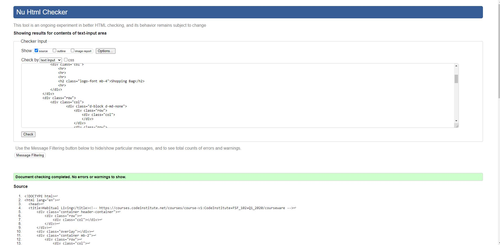   
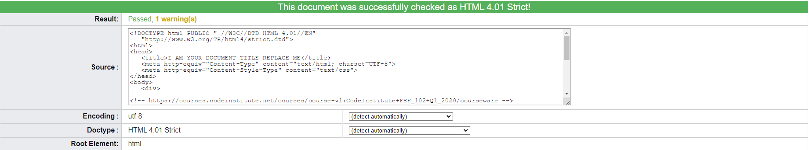      
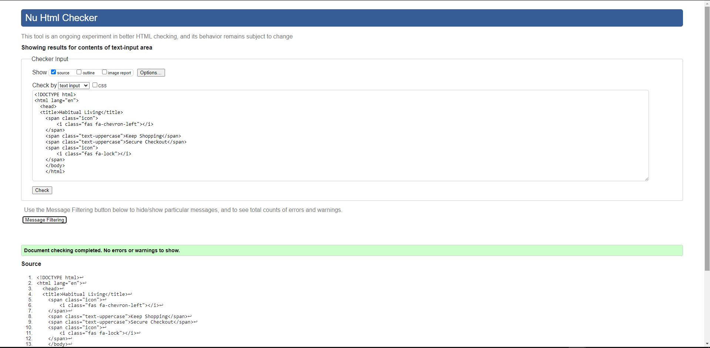   
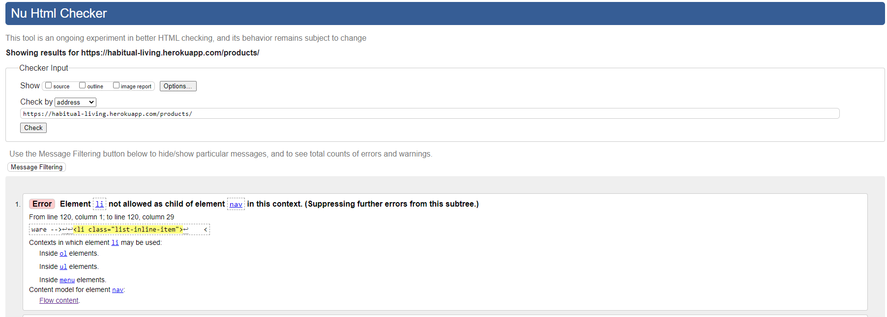  

CSS Code must pass through the W3C CSS Validator. - https://jigsaw.w3.org/
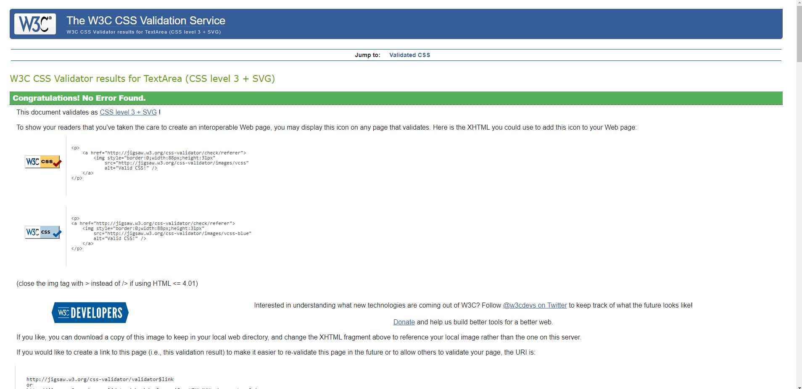 
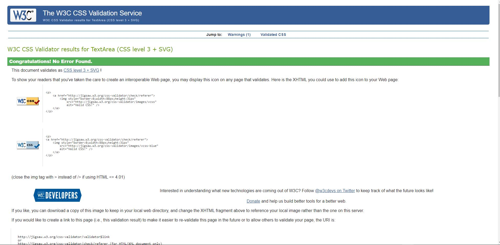   

JavaScript code must pass through the JSHint Validator. https://jshint.com/
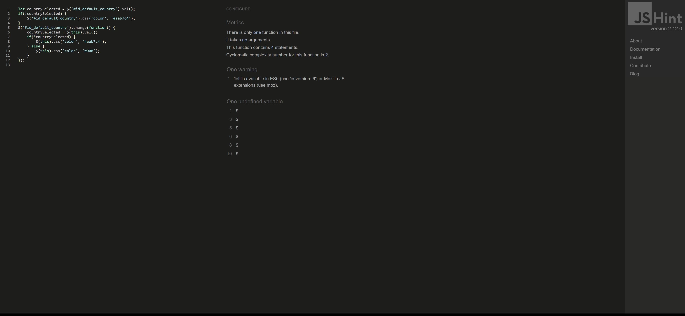  
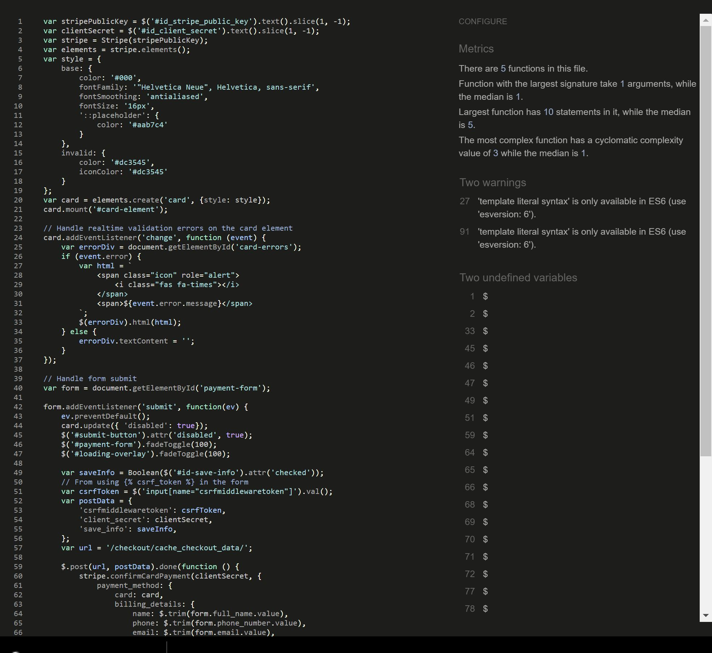 

Python Code must pass through PEP8 Validator - http://pep8online.com/
   
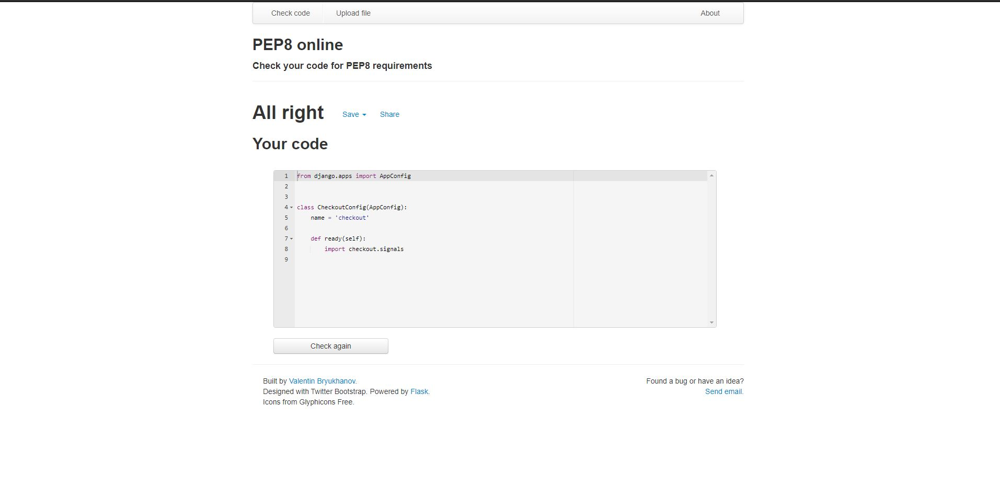   
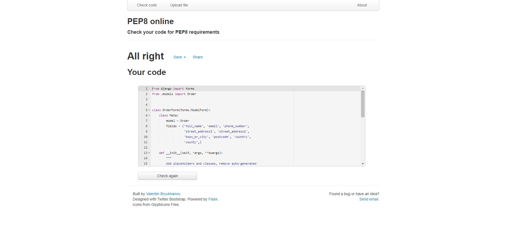   
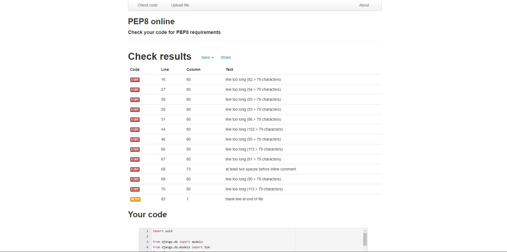   
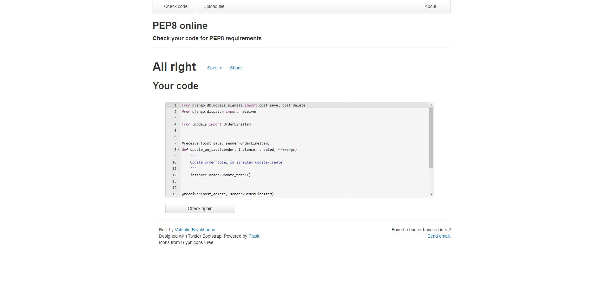    
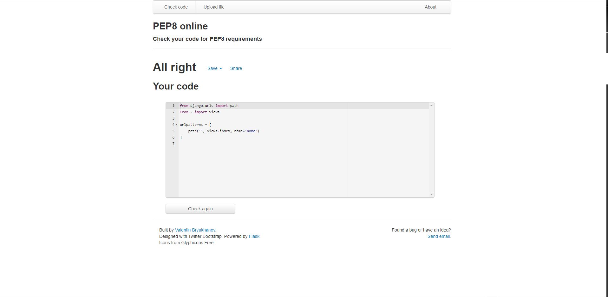   
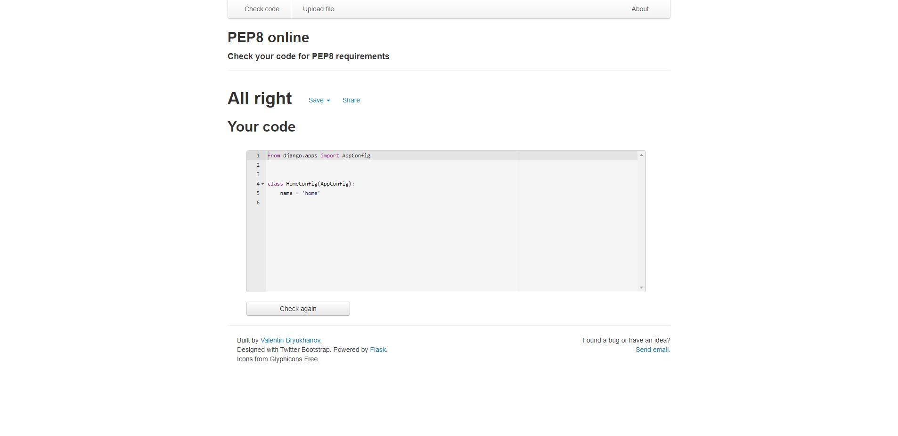   
   
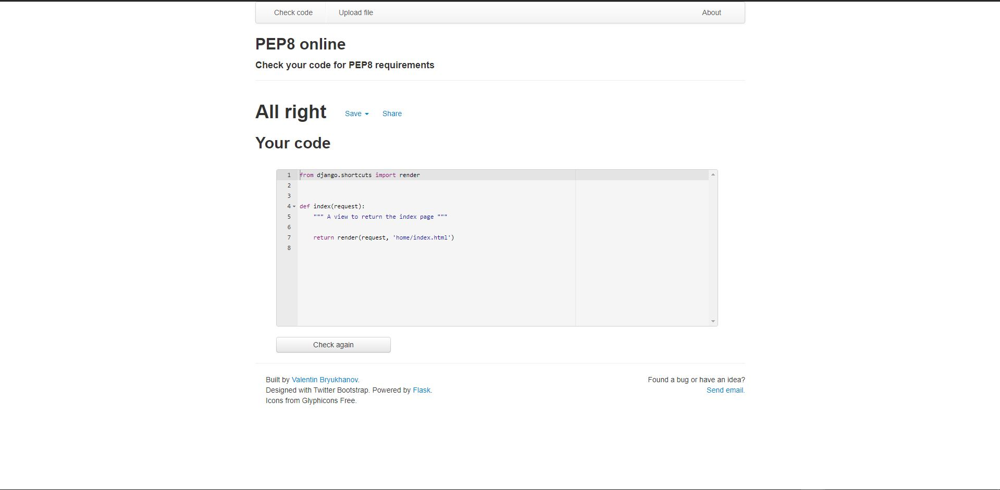   
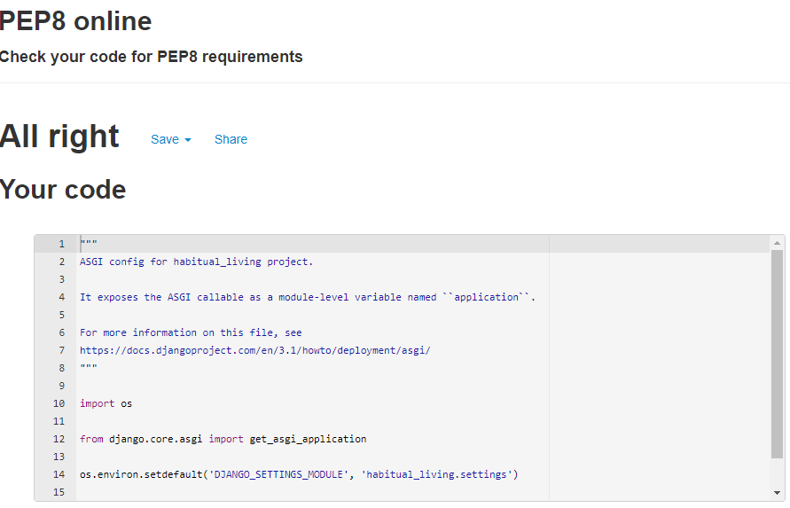   

#### **Summary**
Lighhouse Testing
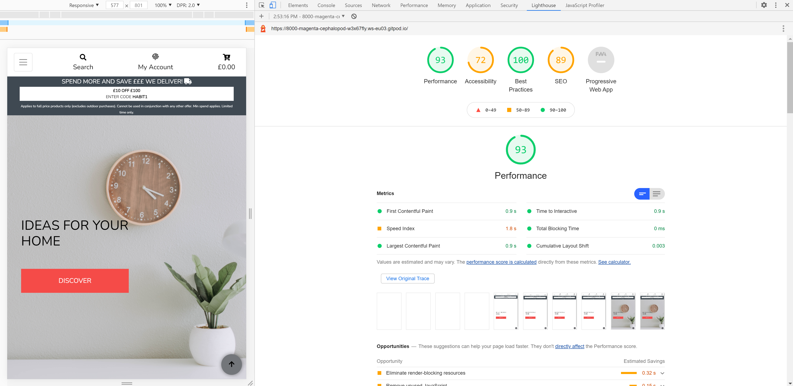   
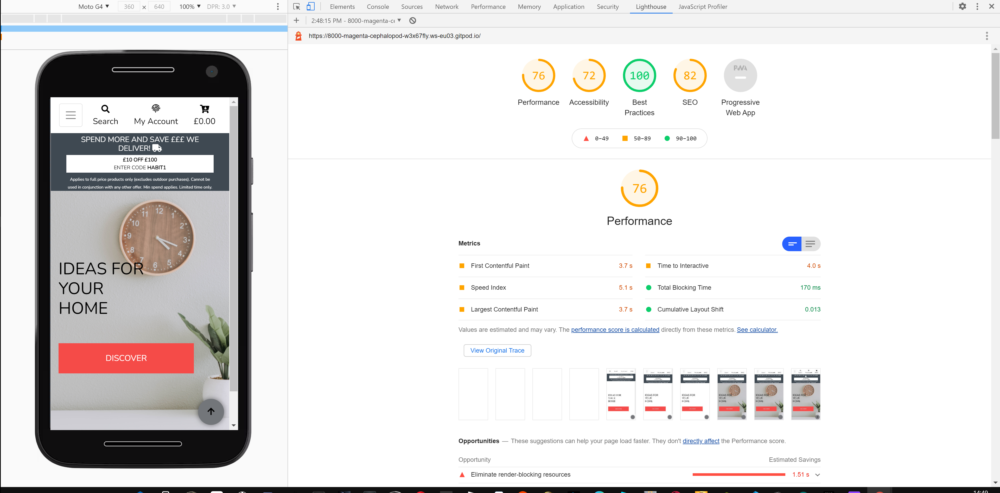 

### Rudimentary Ongoing Testing in Development

* The Website was tested on Google Chrome, Internet Explorer, Opera and Firefox.
* The website was viewed on a variety of devices such as Desktop, Laptop, iphone6 iPhone7, iPhone 8 iPhoneX, iPad, iPad Pro and Pixel 2XL
* A large amount of testing was done to ensure that all pages were linking correctly on both desktop and mobile devices.
* Any bugs related to any reverse path not hosted by external servers would have to be addressed in ongoing developement of this project.

### Known Bugs

*  Running Heroku login from my developer environment will only work with <heroku login -i> command.
*  Then run command <heroku config:set DISABLE_COLLECTSTATIC=1 --app habitual-living>, (The latest build is now automatically configured from Heroku)
*  Unresolved bug with toast after signing in new user did not notify successful sign in or sign out.

## Unresolved Issues

* When leaving the shopping bag area and navigating to the home page to register or use the items from the dropdown menu. I noticed that the links were not clickable until I refreshed or click on the brand logo.

## Resolved Issues

- Ensuring SECRET_KEY was not pushed through version control - used local Gitpod settings to store secret key, operational STOP/START workspace to set environ.objects
- Static images wouldn't load in browser window - Bucket policy from AWS S3 was not saved and code missing. Resolved this by injecting the code content into the code editoring bucket window policy and re-saved.
- Unable to see email verification view after registering email - added 'block inner_content' template to properly render page.

#### **Access Requirements**
Tester must have access to Django in order to manually verify the insertion 
of records to users and events collections.

#### **Develop Mode Testing**
All features previous tested during development in a local environment must be tested 
in a production instance on the live website.

#### **Heroku Dependencies**
Testing is dependent on the website being deployed live on Heroku.

****

### GitHub Pages
### Project Creation

To create this project I used the CI Gitpod Full Template by navigating 
[here](https://github.com/Code-Institute-Org/gitpod-full-template) and clicking the 'Use this template' button.

I was then directed to the create new repository from template page and entered in my desired repo name, then 
clicked Create repository from template button.

Once created, I navigated to my new repository on GitHub and clicked the Gitpod button which built my workspace.

The following commands were used for version control throughout the project:

* git add *filename* - This command was used to add files to the staging area before committing.

* git commit -m "commit message explaining the updates" - This command was used to to commit changes to the local repository.

* git push - This command is used to push all committed changes to the GitHub repository.

**Set up connection to Github Repository:**

1. Click the deploy tab and select GitHub - Connect to GitHub.
2. A prompt to find a github repository to connect to will then be displayed.
3. Enter the repository name for the project and click search.
4. Once the repo has been found, click the connect button.

### Local hosts status

* SECURITY WARNING: keep the secret key used in production secret!
* SECRET_KEY = os.environ.get('SECRET_KEY', '')

* SECURITY WARNING: don't run with debug turned on in production!
* DEBUG = 'DEVELOPMENT' in os.environ

* ALLOWED_HOSTS = ['habitual-living.herokuapp.com', 'localhost']

**Note: You must have the connection details in order to do this. These details are private and not disclosed in this repository 
for security purposes.**

1. Navigate to the GitHub [Repository](https://github.com/Benjamin144/Habitual-Living).
2. Click the Code drop down menu.
3. Either Download the ZIP file, unpackage locally and open with IDE (This route ends here) OR Copy Git URL from the HTTPS dialogue box.
4. Open your developement editor of choice and open a terminal window in a directory of your choice.
5. Use the 'git clone' command in terminal followed by the copied git URL.
6. A clone of the project will be created locally on your machine.

Once the project has been loaded into an IDE of choice, run the following command in the shell to install all the required packages:
> pip install -r requirements.txt

### Fork Project 

Most commonly, forks are used to either propose changes to other development project or to use other developers projects as a starting point 
for your own idea. - Definition from [Github Docs](https://docs.github.com/en/free-pro-team@latest/github/getting-started-with-github/fork-a-repo).

1. Navigate to the GitHub Repository you want to fork.
1. On the top right of the page under the header, click the fork button.
    
    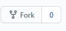
1. This will create a duplicate of the full project in your GitHub Repository.

## Git/Heroku Deployment
### Running remote deployments automatically to Heroku.

**Running application:**
1. Gitpod version control is already connected and deployable to https://habitual-living.herokuapp.com/ 

The site is deployed published at https://habitual-living.herokuapp.com/ from my Herokuapp
My account is also connected to [https://github.com/Benjamin144/habitual-living] my Github page. When I navigate the the 'open app' buton in Heroku, the app loads normally without any problems.

When deploying to GitHub Pages with Heroku the following steps were taken...

1. I Logged in and created a new app on the Heroku platform by calling the new app Habitual Living for the EU region
2. I have then used the 'Postgres database' from within the resources tab of Heroku --provisioned under the free plan Hobby Dev - free
3. Addons included dj-database-url and psycopg2-binary were migrated and my json fixtures were also loaded into the project.
4. I was then allowed to create my superuser account to access the Django Admin pages.
5. By installing Gunicorn you can use it as the webserver and runs a Procfile to tell Heroku to create a web dyno to run Gunicorne to run this site.
6. The results after deploying to Heroku were:

## Output Heroku Deployment Dump

* gitpod /workspace/Habitual-Living $ heroku config:set DISABLE_COLLECTSTATIC=1 --app habitual-living
* Setting DISABLE_COLLECTSTATIC and restarting ⬢ habitual-living... done, v5
* DISABLE_COLLECTSTATIC: 1
* gitpod /workspace/Habitual-Living $ git add .
* gitpod /workspace/Habitual-Living $ git commit -m "deploying to Heroku-2"
* [master 4e6bfb3] deploying to Heroku-2
* 3 files changed, 14 insertions(+), 7 deletions(-)
* create mode 100644 Procfile
* gitpod /workspace/Habitual-Living $ git push
* Enumerating objects: 10, done.
* Counting objects: 100% (10/10), done.
* Delta compression using up to 16 threads
* Compressing objects: 100% (5/5), done.
* Writing objects: 100% (6/6), 733 bytes | 733.00 KiB/s, done.
* Total 6 (delta 4), reused 0 (delta 0), pack-reused 0
* remote: Resolving deltas: 100% (4/4), completed with 4 local objects.
* To https://github.com/Benjamin144/Habitual-Living.git
* f410265..4e6bfb3  master -> master
* gitpod /workspace/Habitual-Living $ git push heroku master
* fatal: 'heroku' does not appear to be a git repository
* fatal: Could not read from remote repository.

* Please make sure you have the correct access rights and the repository exists.
* gitpod /workspace/Habitual-Living $ heroku git:remote -a habitual_living
* ›   Error: Couldn't find that app.
* ›
* ›   Error ID: not_found
* gitpod /workspace/Habitual-Living $ heroku git:remote -a habitual-living
* set git remote heroku to https://git.heroku.com/habitual-living.git
* gitpod /workspace/Habitual-Living $ git push heroku master
* Enumerating objects: 1304, done.
* Counting objects: 100% (1304/1304), done.
* Delta compression using up to 16 threads
* Compressing objects: 100% (482/482), done.
* Writing objects: 100% (1304/1304), 17.57 MiB | 11.70 MiB/s, done.
* Total 1304 (delta 664), reused 1290 (delta 657), pack-reused 0
* remote: Compressing source files... done.
* remote: Building source:
* remote: 
* remote: -----> Building on the Heroku-20 stack
* remote: -----> Determining which buildpack to use for this app
* remote: -----> Python app detected
* remote: -----> Installing python-3.6.13
* remote: -----> Installing pip 20.1.1, setuptools 47.1.1 and wheel 0.34.2
* remote: -----> Installing SQLite3
* remote: -----> Installing requirements with pip
* remote:        Collecting asgiref==3.3.1
* remote:          Downloading asgiref-3.3.1-py3-none-any.whl (19 kB)
* remote:        Collecting dj-database-url==0.5.0
* remote:          Downloading dj_database_url-0.5.0-py2.py3-none-any.whl (5.5 kB)
* remote:        Collecting Django==3.1.7
* remote:          Downloading Django-3.1.7-py3-none-any.whl (7.8 MB)
* remote:        Collecting django-allauth==0.44.0
* remote:          Downloading django-allauth-0.44.0.tar.gz (572 kB)
* remote:        Collecting django-countries==7.1
* remote:          Downloading django_countries-7.1-py3-none-any.whl (792 kB)
* remote:        Collecting django-crispy-forms==1.11.2
* remote:          Downloading django_crispy_forms-1.11.2-py3-none-any.whl (112 kB)
* remote:        Collecting gunicorn==20.1.0
* remote:          Downloading gunicorn-20.1.0.tar.gz (370 kB)
* remote:        Collecting oauthlib==3.1.0
* remote:          Downloading oauthlib-3.1.0-py2.py3-none-any.whl (147 kB)
* remote:        Collecting Pillow==8.1.2
* remote:          Downloading Pillow-8.1.2-cp36-cp36m-manylinux1_x86_64.whl (2.2 MB)
* remote:        Collecting psycopg2-binary==2.8.6
* remote:          Downloading psycopg2_binary-2.8.6-cp36-cp36m-manylinux1_x86_64.whl (3.0 MB)
* remote:        Collecting PyJWT==2.0.1
* remote:          Downloading PyJWT-2.0.1-py3-none-any.whl (15 kB)
* remote:        Collecting python3-openid==3.2.0
* remote:          Downloading python3_openid-3.2.0-py3-none-any.whl (133 kB)
* remote:        Collecting pytz==2021.1
* remote:          Downloading pytz-2021.1-py2.py3-none-any.whl (510 kB)
* remote:        Collecting requests-oauthlib==1.3.0
* remote:          Downloading requests_oauthlib-1.3.0-py2.py3-none-any.whl (23 kB)
* remote:        Collecting sqlparse==0.4.1
* remote:          Downloading sqlparse-0.4.1-py3-none-any.whl (42 kB)
* remote:        Collecting stripe==2.56.0
* remote:          Downloading stripe-2.56.0-py2.py3-none-any.whl (204 kB)
* remote:        Collecting requests
* remote:          Downloading requests-2.25.1-py2.py3-none-any.whl (61 kB)
* remote:        Collecting defusedxml
* remote:          Downloading defusedxml-0.7.1-py2.py3-none-any.whl (25 kB)
* remote:        Collecting certifi>=2017.4.17
* remote:          Downloading certifi-2020.12.5-py2.py3-none-any.whl (147 kB)
* remote:        Collecting urllib3<1.27,>=1.21.1
* remote:          Downloading urllib3-1.26.4-py2.py3-none-any.whl (153 kB)
* remote:        Collecting idna<3,>=2.5
* remote:          Downloading idna-2.10-py2.py3-none-any.whl (58 kB)
* remote:        Collecting chardet<5,>=3.0.2
* remote:          Downloading chardet-4.0.0-py2.py3-none-any.whl (178 kB)
* remote:        Building wheels for collected packages: django-allauth, gunicorn
* remote:          Building wheel for django-allauth (setup.py): started
* remote:          Building wheel for django-allauth (setup.py): finished with status 'done'
* remote:          Created wheel for django-allauth: filename=django_allauth-0.44.0-py3-none-any.whl size=897448 sha256=7b9359899d48520d1470614a04e3fe945b9474d58bc0a1a92a9be2c4311499cc
* remote:          Stored in directory: /tmp/pip-ephem-wheel-cache-a5u4ldmq/wheels/1f/48/08/742600c525478888d4ec4d304491a0299df29d55b372410dfe
* remote:          Building wheel for gunicorn (setup.py): started
* remote:          Building wheel for gunicorn (setup.py): finished with status 'done'
* remote:          Created wheel for gunicorn: filename=gunicorn-20.1.0-py3-none-any.whl size=78918 sha256=d14b60143e46396c34b975d819ba8f422e17cb3fe8d6b19bae4bf88bb5a93c41
* remote:          Stored in directory: /tmp/pip-ephem-wheel-cache-a5u4ldmq/wheels/9a/86/37/cad4bc71746b420e17c4eb0f5c41cf7b5e653c1fdbda27d198
* remote:        Successfully built django-allauth gunicorn
* remote:        Installing collected packages: asgiref, dj-database-url, pytz, sqlparse, Django, defusedxml, python3-openid, oauthlib, certifi, urllib3, idna, chardet, requests, requests-oauthlib, PyJWT, django-allauth, django-countries, django-crispy-forms, gunicorn, Pillow, psycopg2-binary, stripe
* remote:        Successfully installed Django-3.1.7 Pillow-8.1.2 PyJWT-2.0.1 asgiref-3.3.1 certifi-2020.12.5 chardet-4.0.0 defusedxml-0.7.1 dj-database-url-0.5.0 django-allauth-0.44.0 django-countries-7.1 django-crispy-forms-1.11.2 gunicorn-20.1.0 idna-2.10 oauthlib-3.1.0 psycopg2-binary-2.8.6 python3-openid-3.2.0 pytz-2021.1 requests-2.25.1 requests-oauthlib-1.3.0 sqlparse-0.4.1 stripe-2.56.0 urllib3-1.26.4
* remote: -----> Discovering process types
* remote:        Procfile declares types -> web
* remote: 
* remote: -----> Compressing...
* remote:        Done: 72.5M
* remote: -----> Launching...
* remote:        Released v6
* remote:        https://habitual-living.herokuapp.com/ deployed to Heroku
* remote: 
* remote: Verifying deploy... done.
* To https://git.heroku.com/habitual-living.git
* [new branch]      master -> master

****
7. You can then click on the Deploy tab in the Heroku menu bar and choose 'connect to GitHub' search for the repository at Github then connect that way.
8. I have enabled automatic deploys to automatically update Heroku
9. I have set DEBUG to 'True' under 'DEVELOPMENT' in local gitpod enviro/workspace settings.
10. All configs were pushed to Github and successfully deployed to Heroku.

## AWS S3 Deployment

1. Static files are stored in S3 o the Amazon Web Services bucket under Habitual-Living
2. I have editied the static website hosting and used a CORS configuration.
3. I have then used the AWS Policy generator to generate an S3 policy for Habitual-Living, with the GET object method. Then pasted in the ARN as <arn:aws:s3:::habitual-living>. 
    I then pasted in the policy into there bucket policy editor
4. I then accessed the access control list to and enabled the list for public access. 

## Amazon Identity & Access Management

1. I have created a group in IAM called [manage-habitual-living]for the site users.
2. I have also created an access policy giving the group access to the s3 bucket I created by importing a pre built policy supplied by AWS, namely[AmazonS3FullAccess]. In so doing I only want access to items within the habitual-living ARN.
3. All s3 actions are allowed with all actions now within the bucket because of this IAM policy update.
4. Now that this policy has been created, I have attached that policy to the S3 group......
5. I have also assigned a user to to the group named [habitual-living-staticfiles-user] with programmatic access keys, where the security policies are also attached.

****
## Credits

Background image - Taken from [unsplash](https://unsplash.com/) - '/media/samantha-gades-BlIhVfXbi9s-unsplash.jpg'
* [Tim Nelson] - An amazing inspirational teacher - https://courses.codeinstitute.net/courses/course-v1:CodeInstitute+DCP101+2017_T3/courseware/b9bac9a8de154d8d809b0907d30bdea8/debc2a856a0f4ccf8c4b28ebf98bf516/?activate_block_id=block-v1%3ACodeInstitute%2BDCP101%2B2017_T3%2Btype%40sequential%2Bblock%40debc2a856a0f4ccf8c4b28ebf98bf516

### Code

[W3Schools] (https://www.w3schools.com/js/js_json_syntax.asp) - https://www.w3schools.com/js/js_json_datatypes.asp simpletake on json datatypes & syntax
a W3Schools tutorial.

[Bootstrap4](https://getbootstrap.com/docs/4.4/getting-started/introduction/): Bootstrap Library used throughout the project mainly to make site responsive using the Bootstrap Grid System.

[The Code Institute](https://courses.codeinstitute.net/courses/course-v1:CodeInstitute+FSF_102+Q1_2020/courseware) Took inspiration from a series of Code Institute Tutorials.

### Acknowledgements

I'd like to give special thanks to the the following people for their help with my project:

* Code Tutor James for providing me information on how to troubleshoot AWS Bucket policy and 404 + variable settings.
* My Mentor Dick Vlaanderen for continuous helpful feedback.
* Tutor support at Code Institute for their support.
* The Code Institute Slack community for their ongoing support.
* I received inspiration for this project throughout the Code Institutes course material, the content was particularly, and helped me in my process of becoming a competent developer.

Thank you so much for looking at this project!

****

   

  <a href="joseph-roberts-habitual-living--fourth-milestone-project">Back to Top :arrow_heading_up:</a> 

